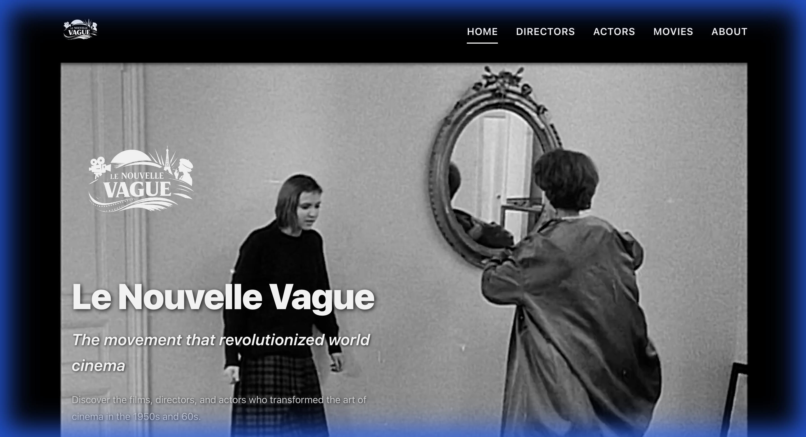
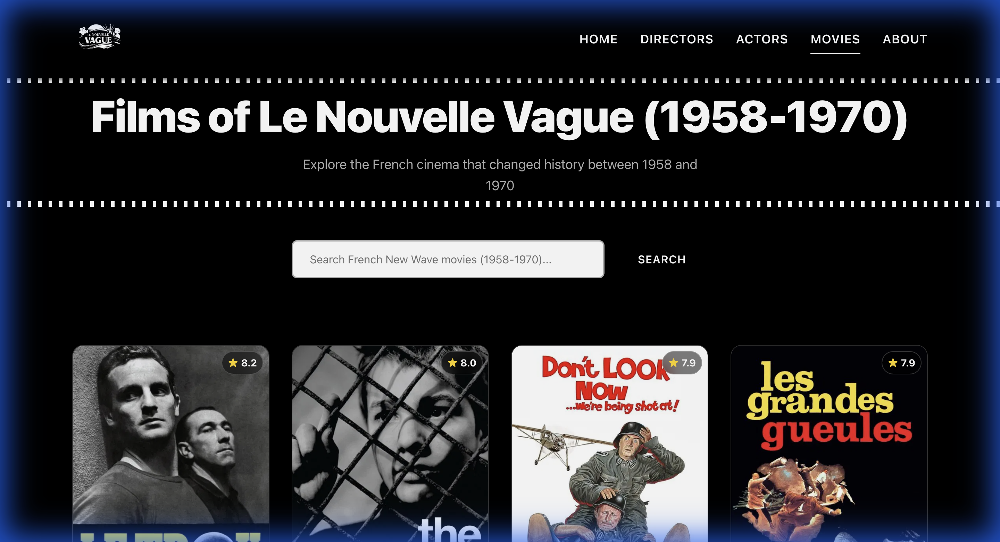
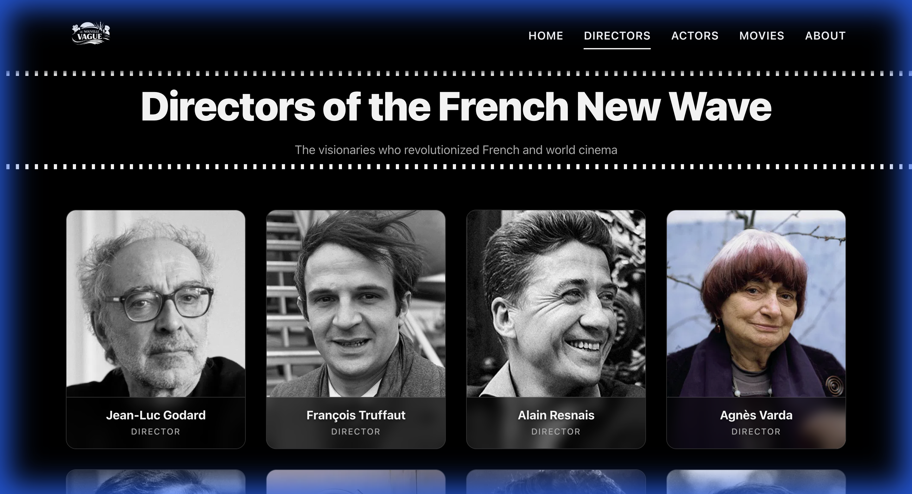

# Le Nouvelle Vague


A high-end, professionally designed web application dedicated to the **French Le Nouvelle Vague** cinema movement. This platform serves as a curated archive for the revolutionary films, directors, and actors that redefined global cinema between **1958 and 1970**.

---

## 📽️ Project Overview

**Le Nouvelle Vague** is more than just a database; it is a cinematic experience. Built with a "Noir" aesthetic, the application combines 1960s vintage visuals with modern web technologies. Every element—from the film-grain overlays to the glassmorphic UI components—is designed to evoke the spirit of Godard, Truffaut, and Varda.

### Key Aesthetic Principles:
- **Monochrome Minimalism**: A strict focus on black, white, and elegant greys.
- **Cinematic Experience**: Autoplaying iconic clips (e.g., *Bande à part*) as hero backgrounds.
- **Historical Accuracy**: Content is strictly filtered to the movement's peak period (1958-1970).

---

## ✨ Key Features

### 🎞️ Curated Movie Archive
- **Time-Travel Search**: A search engine restricted strictly to French films released between 1958 and 1970.
- **Deep Integration**: Full synopses, cast lists, and visual galleries powered by the TMDB API.
- **Historical Filtering**: Ensures no modern entries pollute the vintage atmosphere.

### 🎭 Director & Actor/Actress Profiles
- Comprehensive biographies and filmographies for the icons of the movement.
- Smart出生 year filtering (pre-1955) to maintain contextual relevance.

### 📱 Modern Web Capabilities
- **Responsive Noir Design**: Optimized for everything from small smartphones to large 4K displays.
- **Fluid Motion**: Smooth transitions and micro-interactions powered by Framer Motion.

---

## 🛠️ Tech Stack

- **Frontend**: [React 18](https://reactjs.org/)
- **Build Tool**: [Vite](https://vitejs.dev/)
- **Styling**: Vanilla CSS with custom design tokens
- **Animations**: [Framer Motion](https://www.framer.com/motion/)
- **Data Source**: [TMDB API](https://www.themoviedb.org/documentation/api)
- **Language**: [TypeScript](https://www.typescriptlang.org/)

---

## 🚀 Getting Started

### Prerequisites
- Node.js (v18 or higher)
- A TMDB API Key

### Installation

1. **Clone the repository**
   ```bash
   git clone <repository-url>
   cd le-nouvelle-vague
   ```

2. **Install dependencies**
   ```bash
   npm install
   ```

3. **Environment Setup**
   Create a `.env` file in the root directory:
   ```env
   VITE_TMDB_API_KEY=your_api_key_here
   VITE_TMDB_ACCESS_TOKEN=your_access_token_here
   ```

4. **Launch Development Server**
   ```bash
   npm run dev
   ```

---

## 📸 Interface Preview


*The cinematic Home page featuring a high-definition clip from "Bande à part".*


*The curated Movies library with strict 1958-1970 filtering.*


*The Directors' gallery showcasing the visionaries of the movement.*

---

## 🙏 Attributions

Movie data, images, and cast information are provided by **[The Movie Database (TMDB)](https://www.themoviedb.org)**.


*Note: This product uses the TMDB API but is not endorsed or certified by TMDB.*

---

## 📄 License

**© 2026 Le Nouvelle Vague - All Rights Reserved.**

This software and all associated files are proprietary. Unauthorized copying, modification, or distribution is strictly prohibited. For licensing inquiries, please contact the project owner.

---

## ☕ Support the Project

If you find this project useful or appreciate the curated cinematic experience, consider supporting the developer:

[](https://ko-fi.com/josealvarezdev)

---

**Created and developed by José Álvarez Dev to honor the legacy of disruptive cinema 😎**
